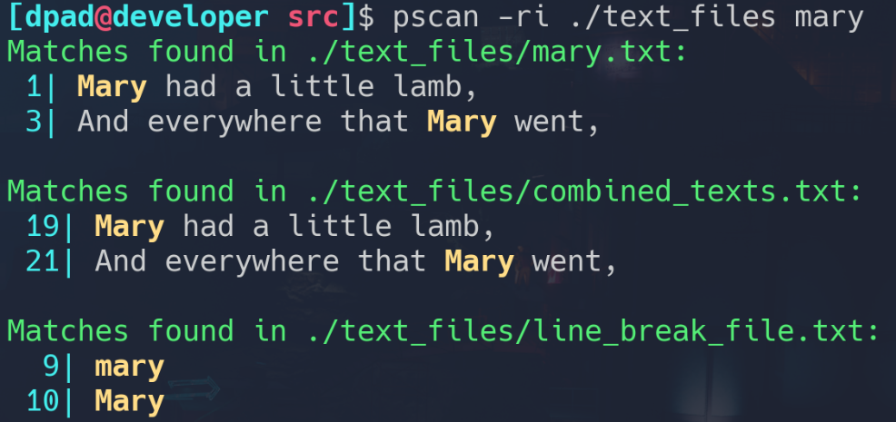

# Project Scan 
This script is a grep-like script written in Rust. A tool that I often use on 
large repo's when I can't remember which python file I left a stray `print()`
statement in.

**Example use:**

